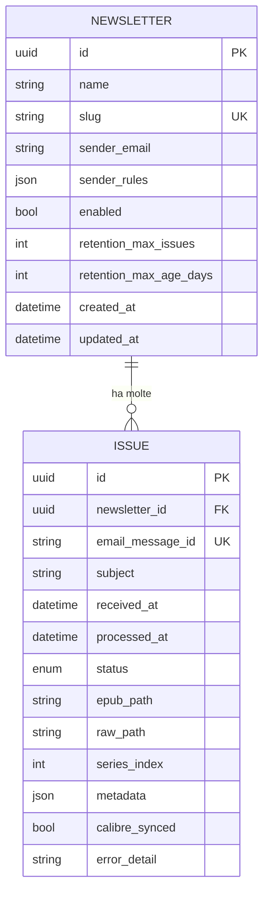

# Modello Dati — CrossPoint Newsletter Server

## Panoramica

Il modello dati è composto da due entità principali con relazione 1:N:

- **Newsletter** — rappresenta una serie editoriale (es. "The Bull").
- **Issue** — rappresenta una singola email convertita in EPUB, episodio della serie.

Il database è **SQLite** (file singolo, zero manutenzione, backup triviale).

---

## Entità

### Newsletter (Serie)

Rappresenta una newsletter a cui l'utente è iscritto. Ogni newsletter è una serie con episodi progressivi.

| Campo | Tipo | Note |
|:---|:---|:---|
| `id` | `UUID` (PK) | UUID v4, generato all'inserimento |
| `name` | `str` | Nome della serie (es. "The Bull") |
| `slug` | `str` (UNIQUE) | Identificativo URL-safe (es. "the-bull") |
| `sender_email` | `str` | Indirizzo email del mittente per matching primario |
| `sender_rules` | `json` | Regole aggiuntive di matching: `[{"type": "subject_contains", "value": "Weekly"}]` |
| `enabled` | `bool` | `true` = ingestione attiva, `false` = sospesa (EPUB esistenti conservati) |
| `retention_max_issues` | `int \| null` | Max issue conservate per questa serie. `null` = illimitato (default) |
| `retention_max_age_days` | `int \| null` | Max età in giorni. `null` = illimitato (default) |
| `created_at` | `datetime` | Timestamp UTC di creazione |
| `updated_at` | `datetime` | Timestamp UTC ultimo aggiornamento |

### Issue (Episodio)

Rappresenta una singola email ricevuta, associata a una newsletter, e il suo stato di elaborazione nella pipeline.

| Campo | Tipo | Note |
|:---|:---|:---|
| `id` | `UUID` (PK) | UUID v4 |
| `newsletter_id` | `UUID` (FK) | Riferimento alla newsletter (serie) |
| `email_message_id` | `str` (UNIQUE) | Header `Message-ID` RFC per deduplica certa |
| `subject` | `str` | Subject dell'email = titolo dell'EPUB |
| `received_at` | `datetime` | Timestamp UTC di ricezione dell'email |
| `processed_at` | `datetime \| null` | Timestamp UTC di completamento conversione |
| `status` | `enum` | Stato corrente nella pipeline (vedi sotto) |
| `epub_path` | `str \| null` | Percorso relativo del file EPUB generato |
| `raw_path` | `str \| null` | Percorso relativo dell'email originale conservata |
| `series_index` | `int` | Indice progressivo nella serie (auto-incrementato per newsletter) |
| `metadata` | `json` | `{"author": "The Bull", "description": "...", "cover_path": "..."}` |
| `calibre_synced` | `bool` | `true` = esportato in Calibre-Web con successo |
| `error_detail` | `str \| null` | Dettaglio errore (se `status = error`) |

### Blacklist (Mittenti Bloccati)

Rappresenta un mittente escluso permanentemente dall'elaborazione e dal triage inbox.

| Campo | Tipo | Note |
|:---|:---|:---|
| `id` | `UUID` (PK) | UUID v4 |
| `sender_email` | `str` (UNIQUE) | Indirizzo email bloccato (normalizzato in lowercase) |
| `sender_name` | `str \| null` | Nome del mittente o pubblicazione rilevato |
| `reason` | `str \| null` | Motivo del blocco (es. "Rifiutato da Inbox", "Manuale") |
| `created_at` | `datetime` | Timestamp UTC di aggiunta alla blacklist |

---

## Macchina a Stati — Issue


```text
         ┌──────────┐
  email   │          │  ingest crea il record
  ────────▶ pending  │
         │          │
         └────┬─────┘
              │
              ▼
         ┌──────────────┐
         │              │  transform avvia la conversione
         │ processing   │
         │              │
         └──┬───────┬───┘
            │       │
     OK     │       │  errore
            ▼       ▼
     ┌──────────┐  ┌──────────┐
     │          │  │          │
     │   done   │  │  error   │──── ri-processabile
     │          │  │          │
     └──────────┘  └──────────┘
```

| Stato | Significato |
|:---|:---|
| `pending` | Email ricevuta e registrata, in attesa di conversione |
| `processing` | Conversione HTML→EPUB in corso |
| `done` | EPUB generato con successo e disponibile |
| `error` | Conversione fallita — `error_detail` contiene il motivo |

Le issue in stato `error` possono essere **ri-processate** manualmente (da CLI o WebUI).

---

## Relazioni



---

## Vincoli di Integrità

- `Newsletter.slug` è **UNIQUE** — usato negli URL OPDS e nei percorsi filesystem.
- `Issue.email_message_id` è **UNIQUE** — garantisce deduplica a livello database.
- `Issue.series_index` è unico per newsletter: **UNIQUE(newsletter_id, series_index)**.
- Cancellazione a cascata: eliminare una newsletter elimina tutte le sue issue, i file EPUB e le email raw.

## Organizzazione Filesystem

```text
data/
├── db/
│   └── newsletter.db              # Database SQLite
├── epub/
│   ├── the-bull/
│   │   ├── the-bull-001.epub
│   │   ├── the-bull-002.epub
│   │   └── ...
│   ├── la-settimana-nat/
│   └── storto/
├── raw/                            # Email originali (default: conservate)
│   ├── the-bull/
│   │   ├── <message-id-hash>.eml
│   │   └── ...
│   └── ...
└── covers/                         # Copertine generate
    ├── the-bull/
    └── ...
```

## Note Implementative

- **UUID v4** per tutte le chiavi primarie (non auto-increment, per portabilità e merge).
- **Timestamp UTC** per tutti i campi datetime.
- **JSON fields** (`sender_rules`, `metadata`) per flessibilità senza migrazioni schema per campi accessori.
- Il campo `metadata` è un JSON flessibile che conterrà almeno: `author`, `description`, `cover_path`.
- Il database SQLite supporta **FTS5** per ricerca full-text (attivabile in N-07).
